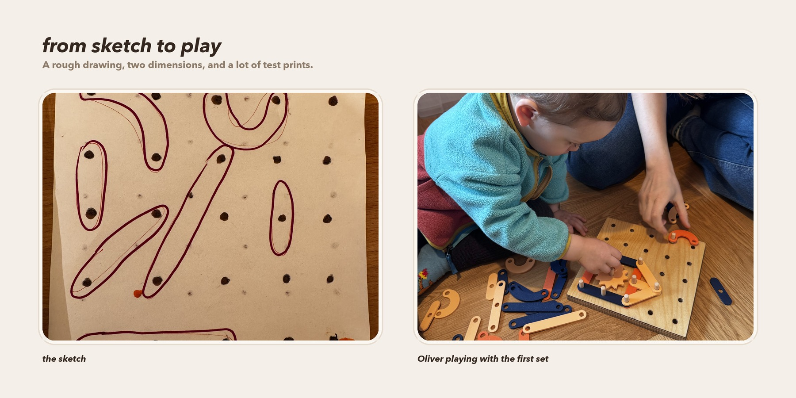

# 📍 Pegboard

A small printable pegboard toy set built on a `40 mm` grid: seven play pieces, one tuned peg, four gears, and two printable boards.

<p align="center">
  
</p>

I had a silly idea for a pegboard toy. Before opening Fusion, SketchUp, or any other CAD tool and drawing it by hand, I wanted to see what an AI agent would do with a rough sketch and two dimensions: the pegs are `40 mm` apart and `8 mm` wide.

This repository is the result. The geometry is kept as plain Python generators, then tuned through real print-and-fit tests.

<p align="center">
  
</p>

## What's here

- `pieces/`  
  Final play pieces plus the tuned peg.
- `gears/`  
  Final smooth gears with beveled outer edges.
- `boards/`  
  Printable `4x4` and `5x5` pegboards using the current provisional board-hole size.
- `board_prototypes/`  
  Single-hole fit coupons for locking in the final printed-board hole diameter.
- `generate_pegboard_shapes.py`  
  Generates the flat pieces and tuned peg.
- `generate_pegboard_gears.py`  
  Generates the gear set.
- `generate_pegboard_board.py`  
  Generates the board-fit coupons and the full printable boards.
- `generate_repository_assets.py`  
  Builds the README images.

## Tuned dimensions

- Grid pitch: `40.0 mm`
- Piece hole diameter: `8.45 mm`
- Gear hole diameter: `8.45 mm`
- Peg: `7.72 mm` diameter, `40.0 mm` long, `1.2 mm` end roundover
- Printed board hole diameter: currently `8.30 mm` and still being validated

## Regenerate

```bash
python3 -m venv .venv
. .venv/bin/activate
pip install -r requirements.txt
python generate_pegboard_shapes.py
python generate_pegboard_gears.py
python generate_pegboard_board.py
python generate_repository_assets.py
```

## Notes

- [PIECES_README.md](PIECES_README.md)
- [GEARS_README.md](GEARS_README.md)
- [BOARDS_README.md](BOARDS_README.md)
- [board_prototypes/README.md](board_prototypes/README.md)
