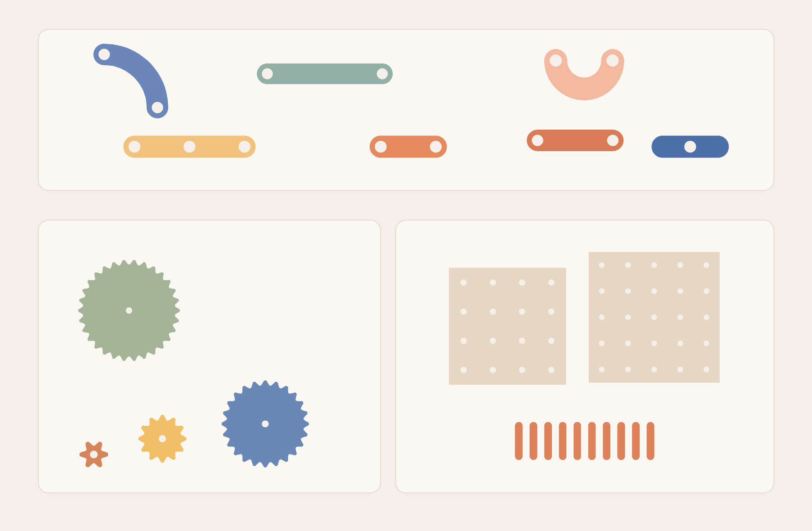

# 📍 Pegboard

AI-generated 3D-printable pegboard toy from a hand-drawn sketch.

<table>
  <tr>
    <th width="50%">What I gave AI</th>
    <th width="50%">What it gave me</th>
  </tr>
  <tr>
    <td></td>
    <td></td>
  </tr>
  <tr>
    <td>A rough marker sketch Oli and I drew together. I gave Codex just two dimensions: the holes are `4 cm` apart and the pegs are `8 mm` wide.</td>
    <td>Oli playing with the first printed set, after a little fit-and-feel iteration.</td>
  </tr>
</table>

## Why This Exists

We have pegboards and plywood scraps all over the apartment. I wanted to make a tiny one for Oli, or maybe even hang one on our front door instead of a wreath so visitors would have something to play with.

I had already cut the scrap wood and drilled the first board when I sat down at the computer, ready to lose an hour or two in Fusion 360. Then I looked at the sketch on my desk, took a photo, pasted it into Codex, and added the only dimensions that mattered: the holes are `40 mm` apart and the pegs are `8 mm` wide.

About a minute later I had the first set of pieces. From there I just iterated a little: print, test, adjust, repeat, until the pegs fit snugly, the pieces felt good by hand, and the gears turned smoothly.

Everything in this repo stays as small Python generators instead of hand-edited meshes, which made those tweaks easy. The time I did not spend drawing every variant in CAD turned into time I could spend printing, testing, and playing with Oli instead.

The current set is a `40 mm` system with seven play pieces, one tuned peg, four gears, and two printable boards.

## Use AI To Tweak It

This repo is intentionally easy to modify with coding agents. [AGENTS.md](AGENTS.md) has the current dimensions, folder layout, and the few rules needed to extend the set safely.

You can ask an agent to:

- build a bigger pegboard like `6x6`
- make the pegs longer or shorter
- add new pieces for different peg combinations
- scale the whole system up or down
- generate tighter or looser fit-test variants

## What's in this repository

<p align="center">
  
</p>

| Play pieces | Gears | Pegboards and pegs |
| --- | --- | --- |
| Seven flat pieces in [models/pieces/](models/pieces) with `8.45 mm` holes, tuned to lift on and off the pegs easily. | Four smooth gears in [models/gears/](models/gears), tuned to mesh on the `40 mm` peg grid. | Two printable boards in [models/boards/](models/boards) plus the tuned peg in [models/pieces/](models/pieces). |

## Repository layout

- `models/`  
  Final STL exports plus the board-fit prototypes.
- `scripts/`  
  Parametric generators for pieces, gears, boards, and README assets.
- `docs/`  
  Supporting notes plus the README images.
- `AGENTS.md`  
  Instructions for coding agents that want to extend the set.

## Tuned dimensions

- Grid pitch: `40.0 mm`
- Piece hole diameter: `8.45 mm`
- Gear hole diameter: `8.45 mm`
- Peg: `7.72 mm` diameter, `40.0 mm` long, `1.2 mm` end roundover
- Printed board hole diameter: currently `8.30 mm`, still being validated

## Regenerate

```bash
python3 -m venv .venv
. .venv/bin/activate
pip install -r requirements.txt
python scripts/generate_pegboard_shapes.py
python scripts/generate_pegboard_gears.py
python scripts/generate_pegboard_board.py
python scripts/generate_repository_assets.py
```

## Notes

- [docs/pieces.md](docs/pieces.md)
- [docs/gears.md](docs/gears.md)
- [docs/boards.md](docs/boards.md)
- [models/board_prototypes/README.md](models/board_prototypes/README.md)
