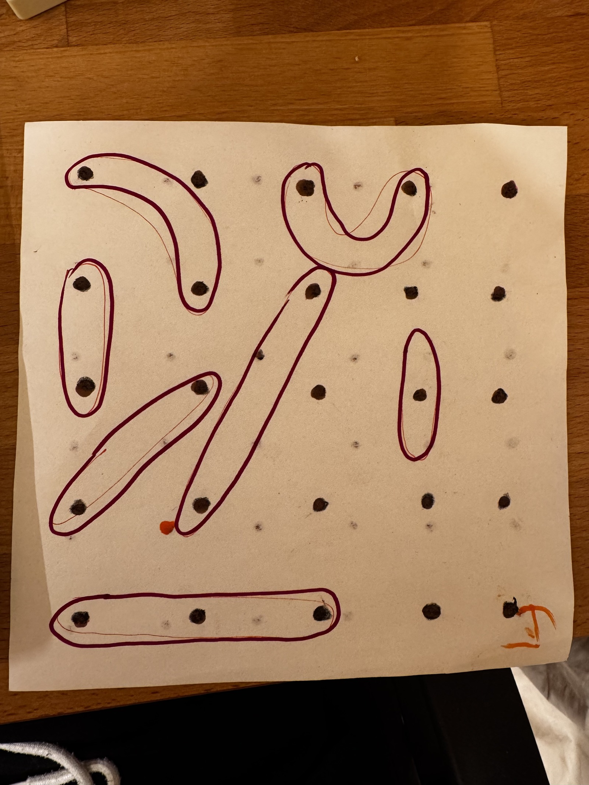
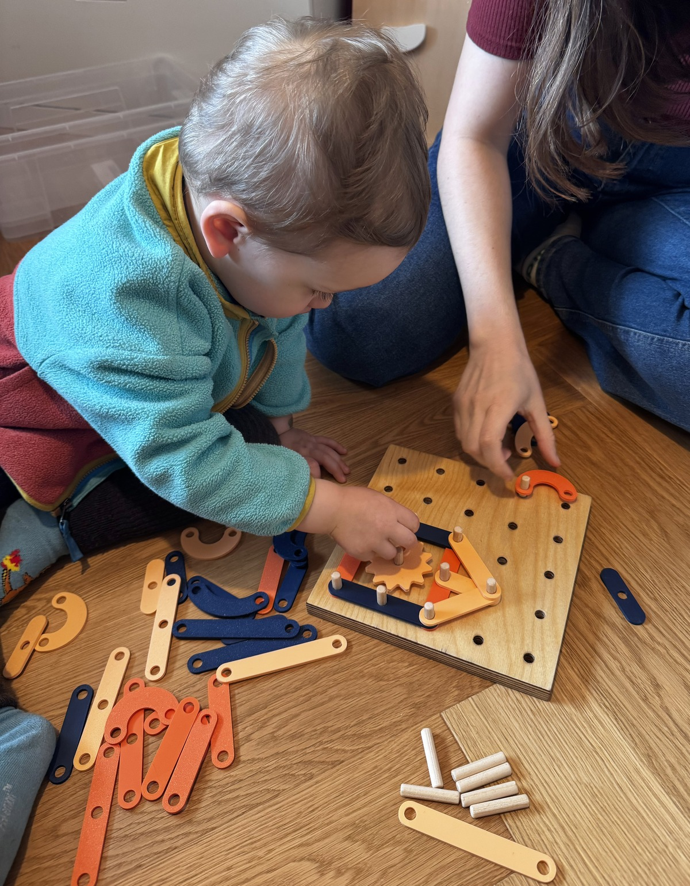

# 📍 Pegboard

AI-generated 3D-printable pegboard toy from a hand-drawn sketch.

## Why This Exists

> I had a silly idea for a pegboard toy. Before opening Fusion, SketchUp, or any other CAD tool and drawing it by hand, I wanted to see what an AI agent would do with a rough sketch and two dimensions: the pegs are `40 mm` apart and `8 mm` wide.

I wanted to make something for Oli. So instead of disappearing into CAD for an evening, I tried a different route: one marker sketch, two real dimensions, and an agent.

This repository is what came out of that: a small printable pegboard toy set built on a `40 mm` grid, with seven play pieces, one tuned peg, four gears, and two printable boards.

<table>
  <tr>
    <th width="50%">What I gave AI</th>
    <th width="50%">What it gave me</th>
  </tr>
  <tr>
    <td></td>
    <td></td>
  </tr>
  <tr>
    <td>One rough marker sketch I drew with Oli, plus two constraints: the holes are `4 cm` apart and `8 mm` wide.</td>
    <td>Oli playtesting the first working set after a few print-and-fit iterations.</td>
  </tr>
</table>

The geometry is kept as plain Python generators, then tuned through real print-and-fit tests. The nice part is that the time I did not spend manually drawing every variant in CAD turned into time I could spend printing, testing, and playing with Oli instead.

## Use AI To Tweak It

If you use coding agents yourself, this repo is meant to be easy to modify. There is an [AGENTS.md](AGENTS.md) at the root with the current dimensions, folder layout, and a few rules for extending the models safely.

You can ask an agent to:

- build a bigger pegboard like `6x6`
- make the pegs longer or shorter
- add new pieces for different peg combinations
- scale the whole system up or down
- generate tighter or looser fit-test variants

## What's in this repository

<p align="center">
  
</p>

| Play pieces | Gears | Pegboards and pegs |
| --- | --- | --- |
| Seven flat pieces in [pieces/](pieces) with `8.45 mm` holes, tuned to lift on and off the pegs easily. | Four smooth gears in [gears/](gears), tuned to mesh on the `40 mm` peg grid. | Two printable boards in [boards/](boards) plus the tuned peg in [pieces/](pieces). |

## Files

- `pieces/`  
  Final play pieces plus the tuned peg.
- `gears/`  
  Final smooth gears with beveled outer edges.
- `boards/`  
  Printable `4x4` and `5x5` pegboards using the current provisional board-hole size.
- `board_prototypes/`  
  Single-hole fit coupons for locking in the final printed-board hole diameter.
- `generate_pegboard_shapes.py`  
  Generates the flat pieces and tuned peg.
- `generate_pegboard_gears.py`  
  Generates the gear set.
- `generate_pegboard_board.py`  
  Generates the board-fit coupons and the full printable boards.
- `generate_repository_assets.py`  
  Builds the README images.
- `AGENTS.md`  
  Instructions for coding agents that want to extend the set.

## Tuned dimensions

- Grid pitch: `40.0 mm`
- Piece hole diameter: `8.45 mm`
- Gear hole diameter: `8.45 mm`
- Peg: `7.72 mm` diameter, `40.0 mm` long, `1.2 mm` end roundover
- Printed board hole diameter: currently `8.30 mm` and still being validated

## Regenerate

```bash
python3 -m venv .venv
. .venv/bin/activate
pip install -r requirements.txt
python generate_pegboard_shapes.py
python generate_pegboard_gears.py
python generate_pegboard_board.py
python generate_repository_assets.py
```

## Notes

- [PIECES_README.md](PIECES_README.md)
- [GEARS_README.md](GEARS_README.md)
- [BOARDS_README.md](BOARDS_README.md)
- [board_prototypes/README.md](board_prototypes/README.md)
